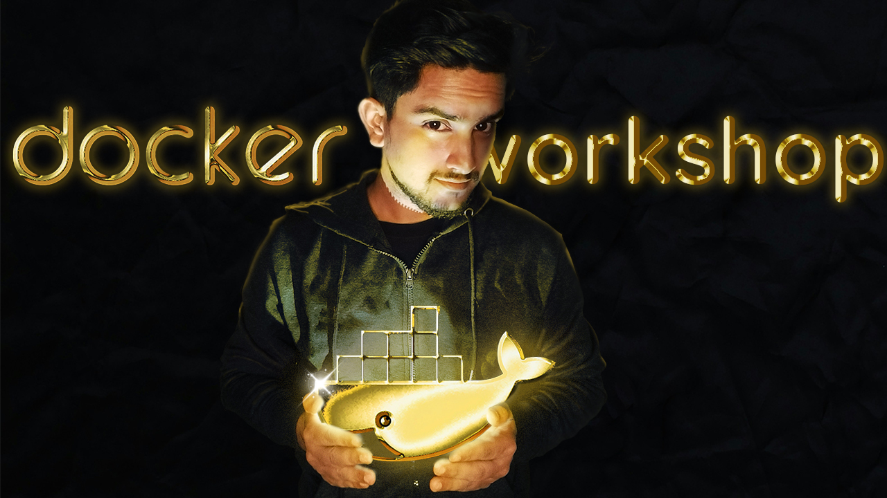

# 🐳 Docker Workshop

> _A complete step-by-step workshop to learn Docker — from the fundamentals to advanced concepts._

---

---

## 🧭 Introduction

Welcome to the **Docker Workshop**, a structured learning journey designed to help you understand Docker from the ground up.

In this workshop, you’ll learn how Docker works, why it exists, and how to build, run, and manage containerized applications effectively.  
Each section builds on the previous one — combining theory with practical understanding.

This repository contains all the structured modules, detailed explanations, and references for every topic included in the curriculum.

---

## 📘 Workshop Curriculum

### **1. Intro to Workshop**
Get an overview of the workshop objectives, structure, and expected outcomes.  
Understand what Docker is and how it fits into the modern software development and DevOps ecosystem.

---

### **2. Understanding Docker**
- What is Docker?  
- What can Docker be used for?  
- The Docker Platform and Architecture  
- Core Docker Objects — Images, Containers, Networks, and Volumes  
- Understanding the client-server model (Docker Daemon, CLI, and API)

---

### **3. Installing Docker**
Learn how to install Docker Engine on Ubuntu (and compatible systems).  
Includes:
- Uninstalling old versions  
- Setting up Docker’s official apt repository  
- Installing Docker Engine and verifying installation  
- Managing Docker as a non-root user

---

### **4. Docker Concepts — The Basics, but in Depth**
- What exactly is a **Container**  
- What is an **Image**  
- What is a **Registry**  
- Understanding how **Docker Compose** simplifies multi-container apps  
- Understanding **image layers** and how they optimize Docker builds  

---

### **5. Building Images**
- Writing a **Dockerfile**  
- Explanation of Dockerfile format and instructions  
- Parser directives and common best practices  
- Building, tagging, and publishing an image  
- Understanding how Docker uses **build cache** to speed up builds  

---

### **6. Running Containers**
- Publishing and exposing ports  
- Overriding container defaults (CMD, ENTRYPOINT)  
- Persisting container data using volumes  
- Sharing local files with containers (bind mounts)  
- Running and managing multi-container applications  

---

### **7. The Workshop (Hands-On Section)**
- **Part 1:** Containerize an application  
- **Part 2:** Update the application  
- **Part 3:** Share the application  
- **Part 4:** Persist the database  
- **Part 5:** Use bind mounts  
- **Part 6:** Build multi-container apps  
- **Part 7:** Use Docker Compose  
- **Part 8:** Learn image-building best practices  
- **Part 9:** Discuss what’s next and how to move forward  

---

---

## 🧱 Objective

This workshop is structured to ensure that you:
- Understand **Docker fundamentals and architecture**  
- Learn to **build and run containers confidently**  
- Gain a deep understanding of **image layering and optimization**  
- Learn to **use Docker Compose** for managing multi-container environments  
- Develop the foundational knowledge for **advanced container orchestration** (Kubernetes, etc.)

---

## 📎 Notes

- The workshop follows a **progressive structure**, starting from basics and moving towards complex Docker concepts.  
- All examples and content are designed to be **system-agnostic** and work on any Linux-based setup (preferably Ubuntu 22.04+).  
- Hands-on labs and demonstrations will be added in future versions of the workshop.

---

## 🧑‍💻 Author

**Laxmikanta Giri / DevOps Dock**  
🎥 [YouTube Channel](https://www.youtube.com/@DevOpsDock)  
_Simplifying DevOps, One Step at a Time._

---

## ⭐ Support

If this workshop helps you learn Docker, please consider **starring** ⭐ the repository and sharing it with others who want to master containerization.

---

